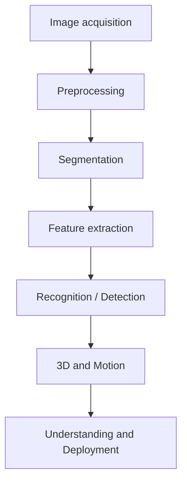

# MCTE 4323 / MCTA 4364 Machine Vision - Course Overview

| Item | Detail |
|---|---|
| Programme | B. Eng (Mechatronics) (Honours) |
| Department | Mechatronics Engineering, Kulliyyah of Engineering |
| Credit value | 3 credits (42 h lecture, 120 h total SLT) |
| Delivery | Lecture and tutorial, 2 sessions x 80 min per week |
| Status | Core, Level 6 |
| Textbook | Sonka, Hlavac & Boyle, *Image Processing, Analysis, and Machine Vision* |

## Synopsis
Machine vision concepts; image acquisition and lighting; image formation and cameras; image processing and analysis; 2D and 3D machine vision; image enhancement; edge detection; image interpretation; object recognition.

## Modernization principle
The accredited outline is classical and contains no deep learning. This offering keeps every accredited topic while modernizing the teaching materials and labs for 2026: detection (R-CNN, YOLO, open-vocabulary), segmentation (U-Net, YOLO-seg, Mask R-CNN, SAM), 3D point clouds, motion tracking, and vision-language models.

## The machine vision pipeline

## Repository map
- `lectures/<week>/README.md` - concise notes, one per week
- `notebooks/<week>/` - hands-on Colab lab with figures, interactive widgets, Q&A and references
- `syllabus/` - CLOs, assessment plan, weekly plan
- `projects/` - mini-project guidelines
- `resources/` - images, videos, models, helper scripts
- `setup/` - environment setup
